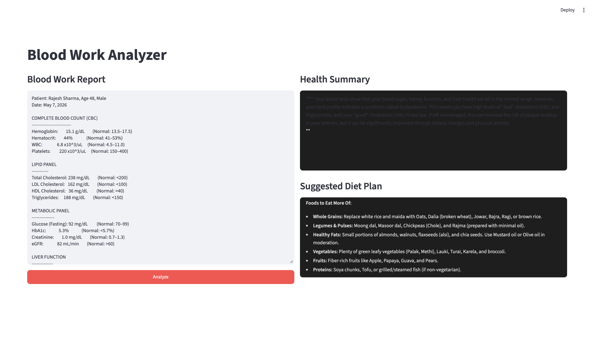

# 🩺 AI Health Insights

An AI-powered health report analyzer that helps users understand blood test reports by generating easy-to-understand health summaries and personalized diet recommendations using Large Language Models (LLMs).

---

## 📖 Overview

Understanding blood test reports can be difficult for many people because of complex medical terminology and numerous health parameters. This project simplifies the process by leveraging AI to analyze blood work reports, explain abnormal values in simple language, and provide personalized health insights and dietary recommendations.

The project demonstrates how LLMs can be integrated into healthcare applications to improve accessibility and understanding of medical reports.

---

## ✨ Features

- 🩸 Analyze complete blood work reports
- 🤖 AI-generated health summaries
- 🩺 Explains abnormal blood parameters in simple language
- 🥗 Personalized diet recommendations
- 📋 Interactive Streamlit interface
- ⚡ Fast AI-powered analysis

---

## 🛠️ Tech Stack

- **Language:** Python
- **Framework:** Streamlit
- **LLM:** Google Gemini API
- **Environment Management:** python-dotenv
- **Development:** Jupyter Notebook

---

## 📁 Project Structure

```text
ai-health-insights/
│
├── app.py
├── blood_work.txt
├── health_analysis.ipynb
├── requirements.txt
├── .gitignore
├── README.md
└── assets/
```

---

## 🚀 Getting Started

### 1. Clone the repository

```bash
git clone https://github.com/Inchara-hub16/ai-health-insights.git
cd ai-health-insights
```

### 2. Create a virtual environment

```bash
python -m venv .venv
```

### 3. Activate the virtual environment

**macOS/Linux**

```bash
source .venv/bin/activate
```

**Windows**

```bash
.venv\Scripts\activate
```

### 4. Install dependencies

```bash
pip install -r requirements.txt
```

### 5. Create a `.env` file

```env
GOOGLE_API_KEY=your_api_key_here
```

### 6. Run the application

```bash
streamlit run app.py
```

---

## 📸 Application Screenshot

Below is the interface of the AI Health Insights application.



### Example Workflow

1. Paste or upload a blood work report.
2. Click **Analyze**.
3. The AI analyzes the report using Google Gemini.
4. A health summary is generated.
5. Personalized diet recommendations are displayed.

---

## 🎯 Future Enhancements

- 📄 PDF blood report upload
- 📊 Health trend visualization
- 📈 Historical report comparison
- 📥 Downloadable health reports
- 👨‍⚕️ Doctor consultation suggestions
- ❤️ Personalized wellness tracking

---

## 👩‍💻 Author

**Inchara Manojkumar**

GitHub: https://github.com/Inchara-hub16

---

## 📄 License

This project is for educational and learning purposes.